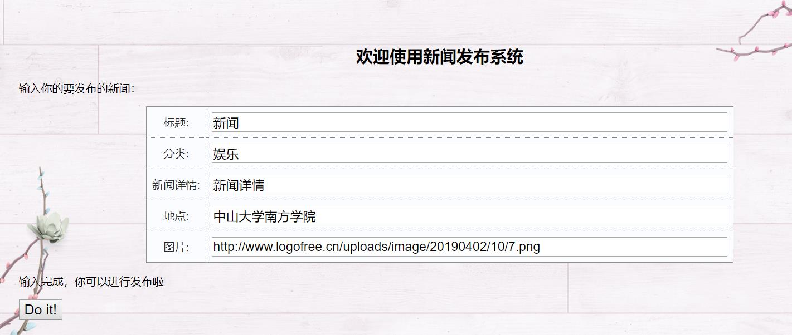
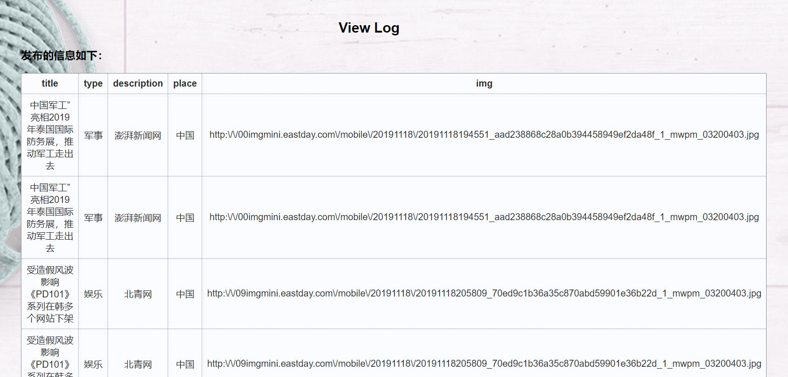

|文档版本|修订时间|属性|描述|备注|修改人|
| ----- | --- | --- | ---------- | --- | --- |
| V1.0 | 2019/12/2 | 新增 | 创建项目要求||黄杰琪|
| v1.1 | 2019/12/5 | 新增 | 项目初步功能设计 | damo雏形完成 | 黄杰琪 |

### 项目三：新闻类网站的全栈开发
|项目名称：|新闻类网站的全栈开发|
| --- | --- |
|版本号|v1.0|
|技术栈|python+html+css|

## v1.1更新如下：
### 实现三个页面转化

### 实现新闻发布页面信息填写并上传数据库

### 实现信息获取进行成功录入数据库提示，并展示给用户观看

### 实现数据库读取用户发布信息列表查询

## 前端

## 后端